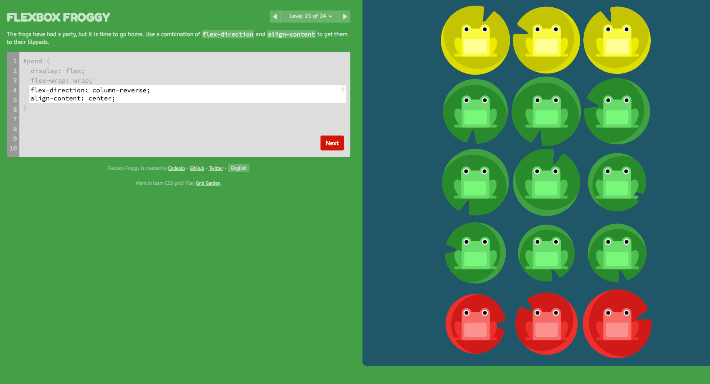
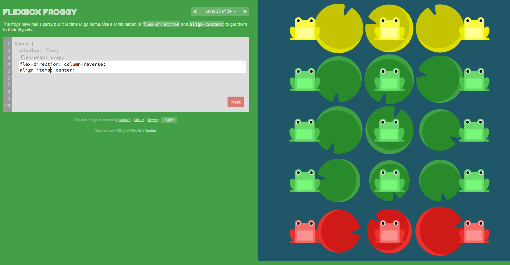

# Flexbox Notes
Date: Wed Jun 28 14:53:08 PDT 2017


Web: http://flexboxfroggy.com/

```
flex-direction: row | row-reverse | column | column-reverse
justify-content: flex-start | flex-end | center | space-between | space-around
align-items: flex-start | flex-end | center | baseline | skretch
order: number;
align-self: auto | flex-start | flex-end | center | baseline | stretch
flex-wrap: nowrap | wrap | wrap-reverse
flex-flow: row wrap
align-content: auto | flex-start | flex-end | center | baseline | stretch
```

*align-content*: determines the spacing between lines

*align-items*: determines how the items as a whole are aligned within the container. When there is only one line, align-content has no effect.






## align-items 

```
flex-start: Items align to the top of the container.
flex-end: Items align to the bottom of the container.
center: Items align at the vertical center of the container.
baseline: Items display at the baseline of the container.
stretch: Items are stretched to fit the container.
```

## justify-content 
 
```
flex-start: Items align to the left side of the container.
flex-end: Items align to the right side of the container.
center: Items align at the center of the container.
space-between: Items display with equal spacing between them.
space-around: Items display with equal spacing around them.
```

## align-content 

To set how multiple lines are spaced apart from each other. This property takes the following values:

```
flex-start: Lines are packed at the top of the container.
flex-end: Lines are packed at the bottom of the container.
center: Lines are packed at the vertical center of the container.
space-between: Lines display with equal spacing between them.
space-around: Lines display with equal spacing around them.
stretch: Lines are stretched to fit the container.
```

## Level 24 Answers
```
flex-direction: column-reverse;
flex-wrap: wrap-reverse;
justify-content: center;
align-content: space-between;
```
